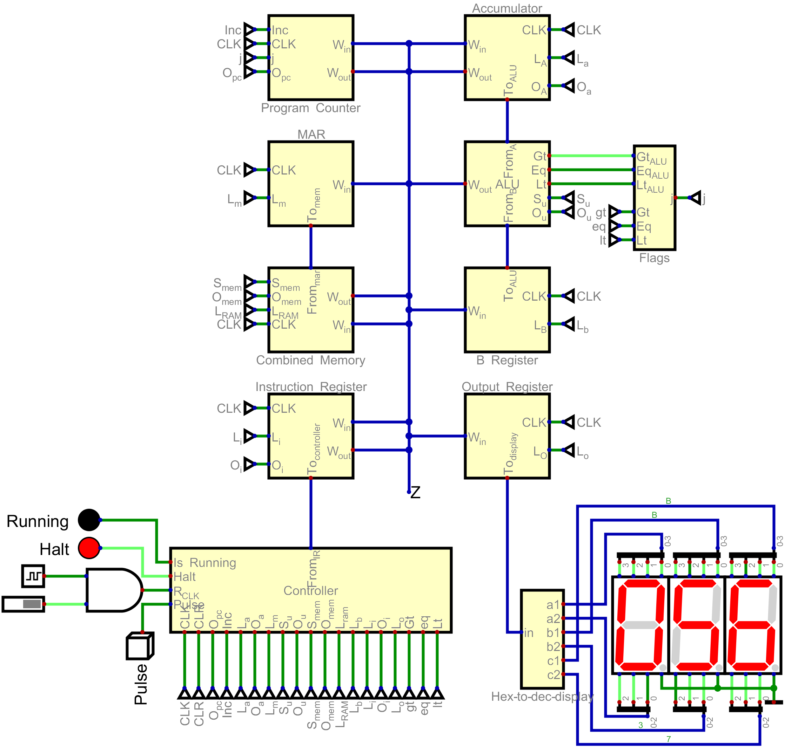

# Homebrew-computer
An 8-bit homebrew computer designed by me.

## Architecture
This is an 8 bit computer, which utilises a Harvard architecture so that the instructions and variables are stored in different memory devices. It is based off the SAP-1 in the book "Digital Computer Electronics" by Malvino and Brown, however I have added a few new instructions.

### Control Unit
The control units consists of an instruction register, and a controller/sequencer. The instruction register holds the current instruction being executes, and sends the op code to the controller, while it is also able to send the operand to the bus if the controller insists. 

The instruction decoding takes place within the controller which sends the opcode to a lookup table, which sends out a memory address, this memory address is then added to the current execute state to get a memory address, it fetches this address from the ROM and is then able to execute the microinstructions needed.

#### T states
There are in total 8 T states available for each instruction, although many use nowhere near the limit.

<strong>T-state 1:</strong> This state fetches the current value of the program counter and stores it in the MAR. 
<strong>T-state 2:</strong> Increment the program counter. 
<strong>T-state 3:</strong> Load the instruction held in the ROM at the address held in the MAR.

T-state 4-8 are then executing the microinstructions for each specific instruction.

For example:
The instruction `4D` means load the accumulator with whatever is held in address D of the accumulator. This translates to in microcodes... 
<strong>T-state 4:</strong> send out the operand of the instruction (in this case `D`) onto the bus, and enabling the MAR to store the current value of the bus. 
<strong>T-state 5:</strong> Enable the RAM, sending out the data held at address `D` onto the bus, and enabling the accumulator to store the current value of the bus. 
<strong>T-state 6:</strong> Tell the controller we are done with this instruction. This is set up the next fetch cycle, since most instructions dont use all 8 T-states this speeds up the execution of the program. 

